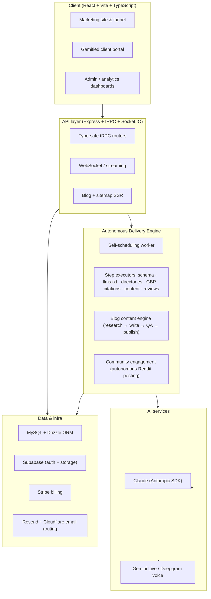

# SuggestedByGPT

> A production, multi-tenant **Generative Engine Optimization (GEO)** platform — a done-for-you SaaS that gets local businesses recommended when people ask AI assistants (ChatGPT, Gemini, Claude, Perplexity) for recommendations.

SuggestedByGPT is the AI-search successor to traditional SEO. Instead of optimizing for the ten blue links, it optimizes the signal stack that large language models actually draw on — structured data, `llms.txt`, directory presence, review distribution, citations, and crawler accessibility — and then **executes that work autonomously** for each client.

This repository is a **public showcase copy** of the production codebase. All secrets, credentials, internal operations notes, and customer data have been removed (see [Security & Scope](#security--scope)). It is shared as a portfolio reference, not as a deployable artifact.

---

## Highlights

- **Built solo, zero-to-production in ~3.5 months**, architected and assembled by directing AI coding agents end-to-end rather than a traditional engineering team.
- **Fully autonomous delivery engine** — a self-scheduling worker processes each client's order through a pipeline of step executors with no human in the loop.
- **Two real-time voice AI agents** (Twilio telephony + Gemini Live / Deepgram) for onboarding and 24/7 support, with streaming audio and sub-second turn latency.
- **Autonomous long-form content engine** that researches, writes, quality-gates, and publishes articles on a recurring cadence across multiple CMS targets.
- **Autonomous web-automation layer** (Playwright / Patchright) that carries out off-platform tasks for clients — content publishing, directory submissions, and strategic community engagement — without human intervention.
- **Full commercial stack** — Stripe checkout & subscription billing, magic-link auth, transactional + drip email, file storage, server-side rendering, and a gamified client portal.

---

## Architecture



---

## Tech stack

| Layer | Technologies |
|---|---|
| **Frontend** | React, TypeScript, Vite, Wouter, TanStack Query, tRPC client, Tailwind CSS, Radix UI / shadcn, MUI, Framer Motion, Recharts, Socket.IO client |
| **Backend** | Node.js, Express, tRPC, Socket.IO, `ws`, Zod, superjson |
| **Data** | MySQL (`mysql2`), Drizzle ORM (32 migrations), Supabase (auth + storage) |
| **AI** | Anthropic Claude SDK, Google Gemini (`@google/genai`), Deepgram (real-time STT/TTS) |
| **Payments** | Stripe (checkout, subscriptions, webhooks) |
| **Email** | Resend (transactional + drip), Cloudflare Email Routing worker |
| **Automation** | Playwright, Patchright, `playwright-extra`, `puppeteer-extra-plugin-stealth` |
| **Auth** | Magic-link (Supabase), `jose` JWTs |
| **Hosting** | Railway (auto-deploy), Cloudflare DNS |

---

## Key subsystems

### Autonomous delivery engine (`server/worker.ts`, `server/serviceExecution.ts`)
A self-scheduling worker wakes on a fixed cadence (and immediately on checkout) and advances each active order through a chain of **step executors**. Each executor produces one deliverable and reports progress back to the portal:

- **Structured data** — `schemaGenerator.ts`, `faqSchemaGenerator.ts` (LocalBusiness + FAQ JSON-LD)
- **AI crawler access** — `llmsTextGenerator.ts`, `robotsTxtAuditor.ts` (GPTBot / ClaudeBot / PerplexityBot / GeminiBot)
- **Directories & local presence** — `directoryAutomation.ts`, `gbpGenerator.ts`, `gbpGuide.ts`, `gbpEmailVerifier.ts`, `bingPlacesOptimizer.ts`, `foursquareOptimizer.ts`
- **Authority & citations** — `citationBuilder.ts`, `citationExecutor.ts`, `linkBuilder.ts`, `guestPostExecutor.ts`, `wikidataEntryGenerator.ts`
- **Reviews & ongoing optimization** — `reviewManager.ts`, `ongoingOptimization.ts`, `contentOptimizer.ts`
- **Client artifacts** — `sopGenerator.ts`, `pdfGenerator.ts` / `pdfTemplate.ts`

### Real-time voice AI (`server/routes/`, `server/voiceSessionLifecycle.ts`)
Streaming voice agents over WebSockets: `gemini-token.ts`, `deepgram-token.ts`, `stt-stream.ts`, `tts.ts`, `voice-context.ts`, `voice-tool.ts`, `echo-stream.ts`. Handles ephemeral token minting, barge-in, tool-calling, and sub-second turn latency for both client onboarding and 24/7 portal support.

### Blog / content engine (`server/blogContent/`)
An end-to-end content pipeline: `topicSeeder.ts` → `longformWriter.ts` / `shortWriter.ts` → `qualityGates.ts` + `antiAiRules.ts` + `verifier.ts` → `schemaBuilder.ts` → `publishQueue.ts`. Multi-CMS publishers (`wordpressPlugin.ts`, `wixOAuth.ts`, `shopifyOAuth.ts`, `squarespacePatchright.ts`, `patchrightUniversal.ts`) push finished, schema-marked articles to client sites. `citationMonitor.ts` tracks whether AI engines start citing the content.

### Community engagement (`server/reddit/`)
An autonomous agent that strategically shares posts on Reddit to help clients earn visibility in communities relevant to their business — one part of the broader GEO process, since community signals feed into how AI assistants form recommendations. The agent handles the full lifecycle on its own, and any credentials it manages are stored encrypted (`server/encryption.ts`).

### AI-visibility scan (`server/routes/scan.ts`, `server/scanScoring.ts`)
The free lead magnet: scores any website across six categories (schema, crawler access, technical SEO, content signals, directory presence, review signals) and produces a graded PDF report. Backed by `websiteRealityChecker.ts` and `websiteStyleScraper.ts`.

### Payments & lifecycle (`server/stripeRouter.ts`, `server/stripeWebhook.ts`, `server/subscriptionManager.ts`)
Stripe checkout, a two-month auto-canceling subscription for the higher tier, webhook-driven order activation, and drip email (`server/emailDrip*.ts`).

### Server-side rendering (`server/blogSsr.ts`)
SSR for `/blog`, `/blog/:slug`, and `/sitemap.xml` so content is fully readable by search engines and AI training crawlers — registered ahead of the SPA static handler.

---

## Repository structure

```
client/                 React + Vite frontend
  src/pages/            Marketing site, funnel, client portal, admin & analytics dashboards
  src/components/       UI library (shadcn/Radix), portal, scan widgets
  src/lib/              tRPC client, helpers
server/                 Express + tRPC backend
  _core/                Claude/LLM, email, Supabase, auth, tRPC, rate limiting, voice
  blogContent/          Autonomous content engine + multi-CMS publishers
  reddit/               Autonomous community-engagement agent (Reddit posting)
  routes/               Voice streaming, scan, scraper, inbound email
  routers/              Feature tRPC routers
shared/                 Types, product catalog, constants shared by client & server
drizzle/                SQL migrations (32) + schema snapshots
infrastructure/         Cloudflare email-routing worker
tools/                  Supporting utilities (Go CORS proxy source)
```

---

## Local development

> Requires Node 20+, pnpm, and a MySQL database.

```bash
pnpm install
cp .env.example .env      # fill in your own keys
pnpm db:push              # apply Drizzle schema
pnpm dev                  # start client + server
```

Other scripts: `pnpm build`, `pnpm start`, `pnpm test` (Vitest), `pnpm check` (typecheck), `pnpm format`.

All configuration is environment-driven — see [`.env.example`](.env.example) for the full list (database, Supabase, Anthropic, Stripe, Resend, and optional automation keys).

---

## Security & scope

This is a **sanitized public copy**, intentionally separated from the deployment repository:

- All API keys, tokens, and passwords were removed; configuration is read from environment variables only.
- Internal operations docs, business-planning material, database dumps, and customer data were excluded.
- Git history was **not** carried over — this repo starts from a single clean commit, so no previously committed secret can be recovered from it.

It is published to demonstrate architecture and engineering scope. It is not configured to run a live business and is not the production deployment.

---

## About

Designed, built, and operated by **Francis Darko** as the sole technical resource — architecture, implementation, and go-to-market — by orchestrating AI coding agents end-to-end.

🌐 [suggestedbygpt.com](https://suggestedbygpt.com)
